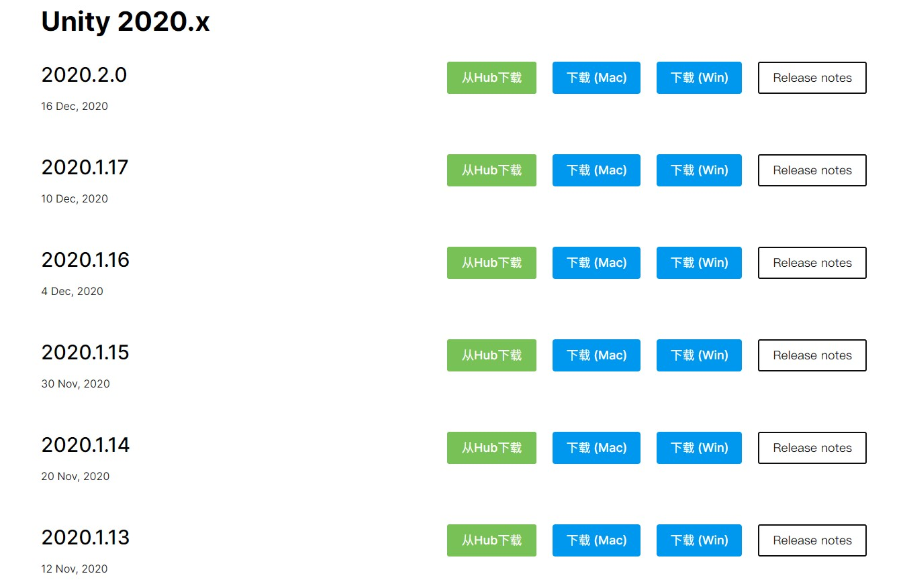
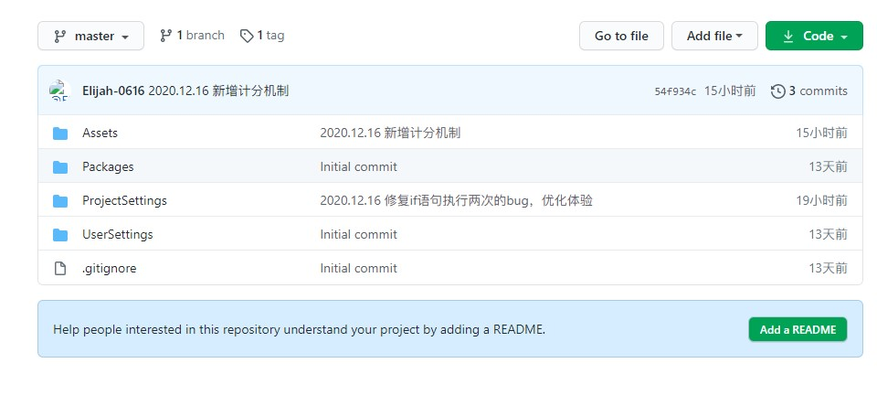
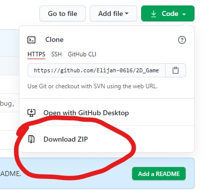
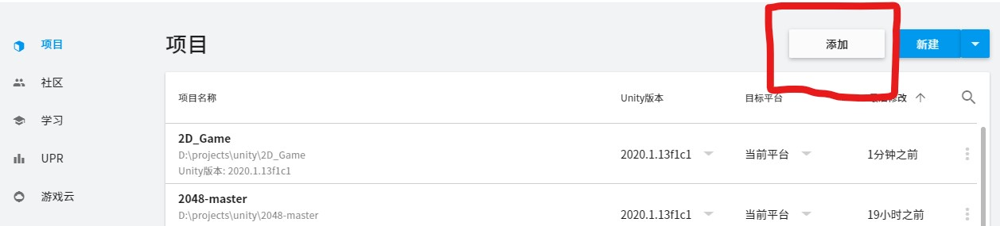

<!--

 * @Author: 谭兴洋
 * @Date: 2020-12-14 19:28:25
 * @LastEditTime: 2020-12-17 17:44:55
 * @LastEditors: Please set LastEditors
 * @Description: In User Settings Edit
 * @FilePath: \2D_Game\README.MD
-->

# Unity2D项目，飞针小游戏

————————————————————————————————————————

## 这个项目是我学习unity3d的过程中做的一个小游戏，这份文档将对步骤进行比较详细的说明

### 如果你想研究这个项目，可以fork一个分支或者clone整个项目

————————————————————————————————————————
————————————————————————————————————————

### 一、准备阶段

1. 安装unity编辑器，这里我使用的是2020.1.13f1c1版本,如果是其他版本，可能会出现一些小问题。你可以从这里下载[unity](https://unity.cn/releases/full/2020) 的安装包,我建议使用hub进行安装。***另：注意请安装至非中文路径***


2. 安装完成后打开UnityHub,然后登录，可以使用微信登录，登陆后，激活许可证，说明如下：


#### 选择激活新许可证


1. 安装IDE，你可以使用VS，即visualstudio进行C#的编写，这里我使用的是JetBrain的Rider，所以不再对软件的安装进行说明，（个人觉得Rider比visualstudio好用，但Rider是付费平台，所以有感兴趣的自行~~找破解版~~购买  :)
2. 接下来下载项目





下载完成后解压至 ***非中文路径***
5. 导入项目

点击项目，导入项目，然后选择你刚刚解压的文件夹


导入后你就会发现，可以打开啦

### 二、场景搭建

### 场景部分比较简单，我将不会详细说明，你也可以直接用我的场景，如果对场景有疑问，可以创建issue,或者邮件联系我。（以后或许我会更新这一部分的文档说明）

## 三、脚本编写

 脚本部分我将会重点描述，部分内容会用注释的形式说明

* ### 首先创建圆的自转脚本,此脚本挂在圆上

1. 声明一个`public`权限类型的2D刚体，用来绑定圆，实现自转。

2. 声明`float`类型的`speed`变量，记录圆自转速度。

3. 创建`GameController`类型的对象，用以访问`GameController`类的方法，并在`start()`方法中初始化。

***注意：`start()`方法为加载时执行，`Update()`方法为每帧执行，所以初始化对象应写在`start()`方法里面，而自转代码应写在`Update()`方法里面***

### 代码如下

```c#
    public Rigidbody2D rb;
    public float speed = 100;
    private GameController _gameController;
    
    private void Start()
    {
        //初始化对象
        var gameControllerObject = GameObject.FindWithTag("MainCamera");    //GameController类的脚本挂在摄像机上，所以此处为MainCamera
        _gameController = gameControllerObject.GetComponent<GameController>();
        rb = GetComponent<Rigidbody2D>();   //h获取刚体属性
    }

    private void Update()
    {
        //如果游戏状态为结束则不再自转，此处为调用的GameController类变量，overOnOff为布尔值，用来判断游戏是否处于结束状态
        if (! _gameController.overOnOff)
        {
            //圆自转代码，自转为Z轴自转，所以X和Y轴值为0
            transform.Rotate (0,0, speed * Time.deltaTime);
        }    
    }
```

* ### 创建针的发射与碰撞脚本,此脚本挂在针上,(不是子物体)

1. 声明一个`public`权限类型的刚体，绑定针，实现针的移动.

2. 声明`float`类型变量记录针的移动速度.声明`bool`类型变量,记录针的移动状态.

3. 创建`GameController`类的对象,用来调用相关方法.

跟上一个脚本一样,在`Start()`方法里面初始化对象,在`Update()`方法里面写控制移动的脚本,代码如下:

```C#
private void Start()
    {        
        rb = GetComponent<Rigidbody2D>();
        var gameControllerObject = GameObject.FindWithTag("MainCamera");
        if (gameControllerObject != null)
        {
            _gameController = gameControllerObject.GetComponent<GameController>();
        }
        else
        {
            print("Can't find 'GameController' script.");
        }
        
    }

    private void Update()
        {
            if (moveOnOff)  //判断针是否处于移动状态
            {
                 rb.MovePosition(rb.position + Vector2.up * (speed * Time.deltaTime));
            }
        }

```

使用Unity内置的`OnTriggerEnter2D()`方法进行碰撞判断,具体代码如下:

```C#
 private void OnTriggerEnter2D(Collider2D other)
        {
        print("OnTriggerEnter调用");
            if (other.CompareTag("Target"))     //判断与针发生碰撞的物体的Tag是否为Target,此处Target标签的物体为圆
        {
        Debug.Log("if语句调用");
        moveOnOff = false;  //修改`moveOnOff`的值为`false`,以停止针的移动
        transform.SetParent(other.gameObject.transform);    //把针设置为圆的子对象,实现针碰撞后跟随圆一起运动
         _gameController.GetNumber(); //调用GetNumber()方法，减少游戏目标的数值
        }
    
        //结束游戏,如果与针发生碰撞的物体Tag为Player,则结束游戏,针(包括子对象)的标签设置为Player
        if (other.CompareTag("Player"))
        {
            print("OverGame执行");
            moveOnOff = false;  //  针停止移动
            _gameController.OverGame();     //调用结束游戏方法
        }
```

此脚本完整代码如下:

```C#
/*
 *                   江城子 . 程序员之歌
 * 
 *               十年生死两茫茫，写程序，到天亮。
 *                   千行代码，Bug何处藏。
 *               纵使上线又怎样，朝令改，夕断肠。
 * 
 *               领导每天新想法，天天改，日日忙。
 *                   相顾无言，惟有泪千行。
 *               每晚灯火阑珊处，夜难寐，加班狂。
 * 
 */

using UnityEngine;

public class MoveAndContact : MonoBehaviour
{
    public Rigidbody2D rb;

    //定义针发射速度
    public float speed = 50;
    public bool moveOnOff = true;

    private GameController _gameController;
    
    private void Start()
    {        
        rb = GetComponent<Rigidbody2D>();
        var gameControllerObject = GameObject.FindWithTag("MainCamera");
        if (gameControllerObject != null)
        {
            _gameController = gameControllerObject.GetComponent<GameController>();
        }
        else
        {
            print("Can't find 'GameController' script.");
        }
        
    }

    private void Update()
        {
            if (moveOnOff)
            {
                 rb.MovePosition(rb.position + Vector2.up * (speed * Time.deltaTime));
            }
        }
    
    private void OnTriggerEnter2D(Collider2D other)
        {
        print("OnTriggerEnter调用");
            if (other.CompareTag("Target"))
        {
        Debug.Log("if语句调用");
        moveOnOff = false;
        transform.SetParent(other.gameObject.transform);
         _gameController.GetNumber(); //调用GetNumber()方法，减少目标数量
        }
    
        //结束游戏
        if (other.CompareTag("Player"))
        {
            print("OverGame执行");
            moveOnOff = false; 
            _gameController.OverGame();
        }
        }
}
```
